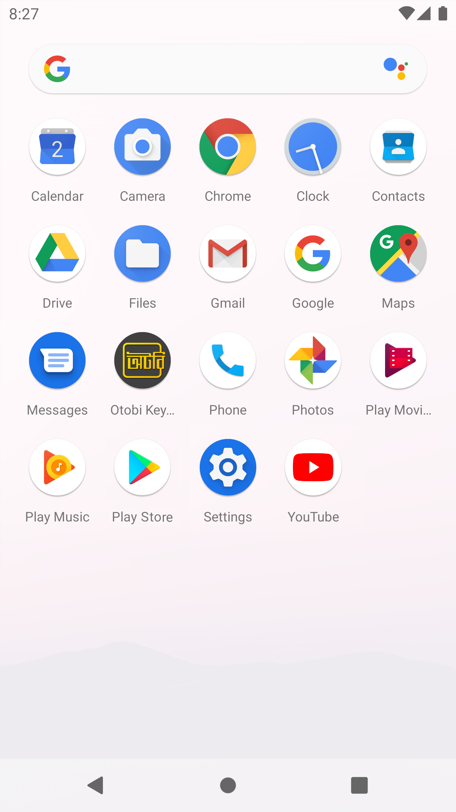

# Otobi Keyboard
The Bangla keyboard for Android in which you are skilled.  

## About
Features:
- Bijoy-like layout for Bangla 
- Adjustable keyboard height for more screen space
- Number row
- Swipe space to move pointer
- Delete swipe
- Ads-free
- Based on Android Open Source Project keyboard
- Free and open-source

